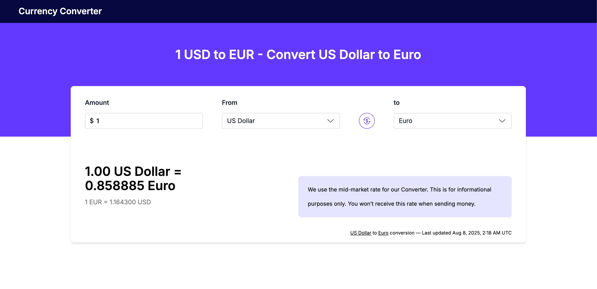

# Calculadora de Cambio de Divisas

Aplicación web para calcular el cambio entre monedas en tiempo real, basada en el diseño provisto en Figma y consumiendo la API pública de [VATComply](https://api.vatcomply.com/docs).

## Vista previa

[App desplegada en Vercel](https://app-cambio-virid.vercel.app/)

## Challenge

Se requiere desarrollar una calculadora de cambio de divisas en React.

**Diseño**: [Figma Link](https://www.figma.com/design/8LKA0727kw0xWmgPurP1jR/Exchange-challenge)  
**API**: [VATComply](https://api.vatcomply.com/docs)

**Precondiciones**:

- Monto inicial: `1.00`
- Conversión inicial: USD → EUR
- No se aceptan montos negativos
- Conversión automática al modificar el valor
- Botón para intercambiar monedas
